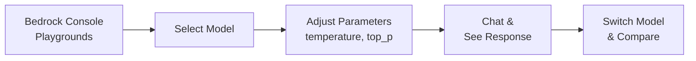
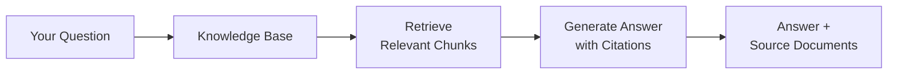
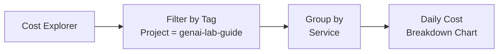

# AWS Console Guide

Where to find, test, and monitor everything you built — directly in the AWS Console.

> **Region:** All resources are in **us-east-1 (N. Virginia)**. Check the top-right corner of the console.

---

## Quick Navigation

| What You Want to Do | Where to Go |
|---|---|
| Chat with models | Bedrock → Playgrounds → Chat |
| Test your RAG Knowledge Base | Bedrock → Knowledge bases → Select → Test |
| Test Guardrails | Bedrock → Guardrails → Select → Test |
| See all lab resources | Resource Groups → `genai-lab-guide` |
| Check project costs | Billing → Cost Explorer → Filter by tag |
| View API call history | CloudTrail → Event history |
| Monitor Bedrock metrics | CloudWatch → Dashboards → `genai-lab-dashboard` |

---

## Testing Each Lab's Output

### Lab 01-03: Foundation Models & Prompt Engineering

**Where to test:** [Bedrock Playgrounds](https://us-east-1.console.aws.amazon.com/bedrock/home?region=us-east-1#/playgrounds/chat)

The Bedrock console has a built-in chat playground where you can:
- Select any model from the dropdown
- Adjust temperature, top_p, max tokens
- Compare outputs between models
- Test system prompts

This is the same thing the notebooks do via API — the console playground uses the same Converse API under the hood.



### Lab 04: Embeddings & Vector Search

**Where to test:** [OpenSearch Serverless](https://us-east-1.console.aws.amazon.com/aos/home?region=us-east-1#opensearch/collections)

- Go to **Serverless → Collections** (not Domains)
- Click `genai-lab-vectors`
- See: collection status, endpoint URL, encryption policy
- Note: OpenSearch Serverless doesn't have a built-in query UI — the notebook is the best way to query vectors

> **Cost warning:** OpenSearch Serverless charges ~$0.50/hr minimum while active. Create it only when running Labs 04-05, and delete when done.

### Lab 05: RAG with Knowledge Bases

**Where to test:** [Bedrock Knowledge Bases](https://us-east-1.console.aws.amazon.com/bedrock/home?region=us-east-1#/knowledge-bases)

This is the most interactive console experience:
1. Click your Knowledge Base
2. Click **Test** in the top right
3. Select a model (Claude Sonnet 4.5)
4. Ask questions about the AWS whitepapers
5. See: generated answer, source chunks, citations, relevance scores



### Lab 06: Bedrock Agents

**Where to test:** [Bedrock Agents](https://us-east-1.console.aws.amazon.com/bedrock/home?region=us-east-1#/agents)

1. Click your agent
2. Click **Test** in the top right
3. Ask it to look up or compare AWS services
4. Watch the **Trace** panel — it shows the ReAct reasoning steps:
   - Thought → Action → Observation → Thought → Final Answer

### Lab 07: Multi-Step Workflows

**Where to test:** [Step Functions](https://us-east-1.console.aws.amazon.com/states/home?region=us-east-1#/statemachines)

1. Click your state machine
2. Click **Start execution**
3. Provide input JSON
4. Watch the **Graph view** — each state lights up as it executes
5. Click any state to see its input/output

This visual execution is one of Step Functions' best features — you can see exactly where a pipeline succeeds or fails.

### Lab 08-09: Evaluation & Optimization

**Where to test:**
- Evaluation jobs: [Bedrock → Model evaluation](https://us-east-1.console.aws.amazon.com/bedrock/home?region=us-east-1#/model-evaluation)
- Batch jobs: [Bedrock → Batch inference](https://us-east-1.console.aws.amazon.com/bedrock/home?region=us-east-1#/batch-inference)

### Lab 10: Guardrails

**Where to test:** [Bedrock Guardrails](https://us-east-1.console.aws.amazon.com/bedrock/home?region=us-east-1#/guardrails)

1. Click your guardrail
2. Click **Test**
3. Try these inputs:
   - `"What is Amazon Bedrock?"` → should pass through
   - `"Should I invest in AMZN stock?"` → should be blocked (denied topic)
   - `"My email is john@example.com"` → should anonymize the email
   - `"My SSN is 123-45-6789"` → should block entirely

### Lab 11: Security & Governance

**Where to test:**
- IAM policies: [IAM → Roles](https://console.aws.amazon.com/iam/home#/roles) → search `genai-lab`
- CloudTrail: [CloudTrail → Event history](https://us-east-1.console.aws.amazon.com/cloudtrailv2/home?region=us-east-1#/events) → filter by Event source: `bedrock.amazonaws.com`
- Invocation logs: [CloudWatch → Log groups](https://us-east-1.console.aws.amazon.com/cloudwatch/home?region=us-east-1#logsV2:log-groups) → `/aws/bedrock/model-invocations`

---

## Seeing All Resources in One Place

### Resource Groups

**Where:** [Resource Groups](https://us-east-1.console.aws.amazon.com/resource-groups/group/genai-lab-guide?region=us-east-1)

All lab resources are tagged with `Project=genai-lab-guide`. The Resource Group shows them in one list.

> **Note:** Some services (like OpenSearch Serverless) don't support deep-linking from Resource Groups. Navigate to those services directly using the links above.

### Resource Inventory

| Resource | Type | Created By | Console Location |
|----------|------|-----------|-----------------|
| `aws-genai-lab-490004637192` | S3 Bucket | setup-resources.py | S3 → Buckets |
| `genai-lab-bedrock-role` | IAM Role | setup-resources.py | IAM → Roles |
| `genai-lab-lambda-role` | IAM Role | setup-resources.py | IAM → Roles |
| `genai-lab-vectors` | OpenSearch Collection | setup-resources.py | OpenSearch → Serverless → Collections |
| Knowledge Base | Bedrock KB | Lab 05 | Bedrock → Knowledge bases |
| Agent | Bedrock Agent | Lab 06 | Bedrock → Agents |
| Guardrail | Bedrock Guardrail | Lab 10 | Bedrock → Guardrails |
| State Machine | Step Functions | Lab 07 | Step Functions → State machines |

> **Ephemeral resources** (Knowledge Base, Agent, Guardrail, State Machine) are created and deleted within each lab. You'll only see them in the console while the lab is running or if you skipped the cleanup cell.

---

## Monitoring Costs

### Cost Explorer

**Where:** [Billing → Cost Explorer](https://us-east-1.console.aws.amazon.com/costmanagement/home#/cost-explorer)

1. Click **Filters** → Tag → `Project` → `genai-lab-guide`
2. Set date range to the period you've been studying
3. Group by **Service** to see which AWS service costs the most



> **First time?** Cost allocation tags need to be activated. Go to [Billing → Cost allocation tags](https://us-east-1.console.aws.amazon.com/billing/home#/tags) → find `Project` → click **Activate**. It takes ~24 hours before tagged costs appear in Cost Explorer.

### AWS Budgets

The `setup-resources.py` script creates a $40 budget. Check it at [Billing → Budgets](https://us-east-1.console.aws.amazon.com/billing/home#/budgets).

### The #1 Cost Trap

**OpenSearch Serverless** charges ~$0.50/hr (~$12/day) minimum while the collection exists — even if you're not using it. This is the single biggest cost risk.

**Protect yourself:**
- Only create it when doing Labs 04-05: `python scripts/setup-resources.py`
- Delete it immediately after: `python scripts/cleanup-all.py`
- Or delete just the collection: `aws opensearchserverless delete-collection --id <collection-id> --region us-east-1`

---

## Monitoring API Usage

### CloudTrail

**Where:** [CloudTrail → Event history](https://us-east-1.console.aws.amazon.com/cloudtrailv2/home?region=us-east-1#/events)

Shows every AWS API call made in your account:

1. Filter: **Event source** → `bedrock.amazonaws.com`
2. You'll see: InvokeModel, Converse, CreateAgent, CreateGuardrail, etc.
3. Click any event for details: who called it, when, from where, request parameters

### CloudWatch (after Lab 11)

If you enabled model invocation logging in Lab 11:

**Where:** [CloudWatch → Log groups](https://us-east-1.console.aws.amazon.com/cloudwatch/home?region=us-east-1#logsV2:log-groups) → `/aws/bedrock/model-invocations`

This shows actual prompts and responses (not just API metadata like CloudTrail). Useful for debugging and auditing what your models are saying.

| What it Shows | CloudTrail | Invocation Logging |
|---|---|---|
| API call metadata (who, when, which model) | Yes | No |
| Request parameters | Yes | No |
| Actual prompt text | No | Yes |
| Actual response text | No | Yes |
| Token counts | No | Yes |

---

## Cleanup

When you're done studying, run:

```bash
python scripts/cleanup-all.py
```

This deletes: OpenSearch collection, IAM roles, S3 bucket contents, downloaded whitepapers.

Verify cleanup in [Resource Groups](https://us-east-1.console.aws.amazon.com/resource-groups/group/genai-lab-guide?region=us-east-1) — the list should be empty.
