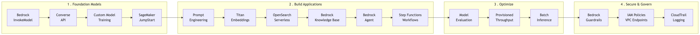

# AWS Generative AI Developer Lab Guide (DEP-C01)

Hands-on lab guide for the AWS Certified Generative AI Developer – Professional exam. 11 Jupyter notebooks covering all 4 exam domains with boto3, Amazon Bedrock, and real AWS infrastructure.

## Who This Is For

- Preparing for the **AWS Certified Generative AI Developer – Professional (DEP-C01)** exam
- Have an AWS account (pay-as-you-go, ~$25-38 total — see [COST-GUIDE.md](COST-GUIDE.md))
- Comfortable with Python and basic AWS concepts

## Quick Start

1. Clone this repo: `git clone https://github.com/btriani/aws-genai-lab-guide.git`
2. Check prerequisites: `bash scripts/check-prerequisites.sh`
3. Provision shared infrastructure: `python scripts/setup-resources.py`
4. Open Lab 01: `labs/01-bedrock-foundation-models.ipynb`

## Labs

| # | Lab | Exam Domain (Weight) | Est. Cost | Est. Time |
|---|-----|---------------------|-----------|-----------|
| 01 | [Bedrock Foundation Models](labs/01-bedrock-foundation-models.ipynb) | D1: Selection & Implementation (26%) | ~$0.35 | 45 min |
| 02 | [Model Selection & Customization](labs/02-model-selection-customization.ipynb) | D1 + D3: Selection + Optimization (26% + 24%) | ~$8-12 | 90 min |
| 03 | [Prompt Engineering](labs/03-prompt-engineering.ipynb) | D2: Building GenAI Apps (30%) | ~$0.30 | 60 min |
| 04 | [Embeddings & Vector Search](labs/04-embeddings-vector-search.ipynb) | D2: Building GenAI Apps (30%) | ~$2-3 | 60 min |
| 05 | [RAG with Knowledge Bases](labs/05-rag-knowledge-bases.ipynb) | D2: Building GenAI Apps (30%) | ~$2-3 | 75 min |
| 06 | [Bedrock Agents & Tool Use](labs/06-bedrock-agents.ipynb) | D2: Building GenAI Apps (30%) | ~$2-3 | 75 min |
| 07 | [Multi-Step GenAI Workflows](labs/07-multi-step-workflows.ipynb) | D2: Building GenAI Apps (30%) | ~$0.20 | 75 min |
| 08 | [Model Evaluation](labs/08-model-evaluation.ipynb) | D3: Optimizing Performance (24%) | ~$2-3 | 60 min |
| 09 | [Inference Optimization & Cost](labs/09-inference-optimization.ipynb) | D3: Optimizing Performance (24%) | ~$3-5 | 60 min |
| 10 | [Guardrails & Responsible AI](labs/10-guardrails-responsible-ai.ipynb) | D4: Security & Governance (20%) | ~$1-2 | 60 min |
| 11 | [Security, Compliance & Logging](labs/11-security-governance.ipynb) | D4: Security & Governance (20%) | ~$1 | 60 min |

**Total estimated cost: ~$25-38** | **Total time: ~12 hours**

See [COST-GUIDE.md](COST-GUIDE.md) for detailed pricing breakdown.

## Exam Domain Coverage

| Domain | Weight | Labs |
|--------|--------|------|
| D1: Selection & Implementation of Foundation Models | 26% | 01, 02 |
| D2: Building Generative AI Applications | 30% | 03, 04, 05, 06, 07 |
| D3: Optimizing Performance & Inference | 24% | 08, 09 |
| D4: Security, Compliance & Governance | 20% | 10, 11 |

## Architecture Overview

## Each Lab Contains

- **notebook.ipynb** — Jupyter notebook with interleaved markdown explanations and executable code cells. Each lab includes an overview, learning objectives, exam domain mapping, architecture diagram, lettered sections (A, B, C...), key takeaways, key concepts table, exam preparation Q&A, and cost breakdown.

## Sample Data

Labs use AWS whitepapers (Well-Architected Framework, Generative AI on AWS, Bedrock User Guide, Shared Responsibility Model) as sample documents for RAG and embedding exercises. Documents are downloaded automatically by `scripts/setup-resources.py`. See [assets/aws-whitepapers/README.md](assets/aws-whitepapers/README.md) for details.

## Cheatsheets

- [Bedrock API Cheatsheet](cheatsheets/bedrock-api-cheatsheet.md) — InvokeModel, Converse, parameters, streaming, Knowledge Base and Agent APIs
- [Exam Domains Cheatsheet](cheatsheets/exam-domains-cheatsheet.md) — Domain breakdown, key concepts, study priority guide
- [Services Comparison Cheatsheet](cheatsheets/services-comparison-cheatsheet.md) — Decision trees: Bedrock vs SageMaker, vector store options, throughput modes

## Troubleshooting & Lessons Learned

Every lab was tested end-to-end against real AWS infrastructure. We documented every issue we hit — deprecated model IDs, OpenSearch Serverless quirks, IAM gotchas, and more. See [TROUBLESHOOTING.md](TROUBLESHOOTING.md) before opening issues.

## Scripts

| Script | Purpose |
|--------|---------|
| `scripts/check-prerequisites.sh` | Verify AWS CLI, Python, credentials, and Bedrock access |
| `scripts/setup-resources.py` | Create S3 bucket, IAM roles, OpenSearch collection, download whitepapers |
| `scripts/cleanup-all.py` | Tear down all lab resources when done studying |

## Official AWS Resources

- [DEP-C01 Exam Guide](https://aws.amazon.com/certification/certified-generative-ai-developer-professional/)
- [AWS Skill Builder — GenAI Learning Plan](https://explore.skillbuilder.aws/learn/lp/2094/generative-ai-learning-plan)
- [Amazon Bedrock Documentation](https://docs.aws.amazon.com/bedrock/)
- [AWS Workshops](https://workshops.aws/)

## Contributing

Contributions welcome — open an issue or pull request.

## License

[MIT](LICENSE)
