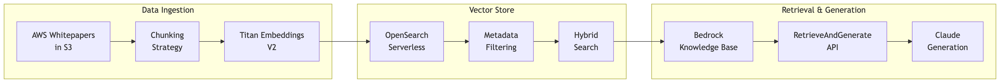

# Bedrock API Cheatsheet



> Quick reference for every Bedrock API you need to know for the AWS Certified AI Practitioner (AIF-C01) and Machine Learning Engineer - Associate (DEA-C01) or the **AWS Generative AI Specialty (DEP-C01)** exam. Code examples use `boto3` with the `bedrock-runtime` and `bedrock-agent-runtime` clients.

---

## 1. InvokeModel

`InvokeModel` sends a single request to a foundation model. The request and response bodies are **model-specific** — each provider has its own JSON schema.

### Client Setup

```python
import boto3, json

bedrock_runtime = boto3.client("bedrock-runtime", region_name="us-east-1")
```

### Claude (Anthropic)

```python
body = json.dumps({
    "anthropic_version": "bedrock-2023-05-31",
    "messages": [
        {"role": "user", "content": "Explain RAG in three sentences."}
    ],
    "max_tokens": 512,
    "temperature": 0.7,
    "top_p": 0.9,
    "top_k": 250
})

response = bedrock_runtime.invoke_model(
    modelId="anthropic.claude-3-5-sonnet-20241022-v2:0",
    contentType="application/json",
    accept="application/json",
    body=body
)

result = json.loads(response["body"].read())
print(result["content"][0]["text"])
```

**Response structure (Claude):**

```json
{
  "id": "msg_abc123",
  "type": "message",
  "role": "assistant",
  "content": [{"type": "text", "text": "..."}],
  "stop_reason": "end_turn",
  "usage": {"input_tokens": 42, "output_tokens": 128}
}
```

### Amazon Titan Text

```python
body = json.dumps({
    "inputText": "Explain RAG in three sentences.",
    "textGenerationConfig": {
        "maxTokenCount": 512,
        "temperature": 0.7,
        "topP": 0.9,
        "stopSequences": []
    }
})

response = bedrock_runtime.invoke_model(
    modelId="amazon.titan-text-express-v1",
    contentType="application/json",
    accept="application/json",
    body=body
)

result = json.loads(response["body"].read())
print(result["results"][0]["outputText"])
```

**Response structure (Titan Text):**

```json
{
  "inputTextTokenCount": 12,
  "results": [
    {
      "tokenCount": 95,
      "outputText": "...",
      "completionReason": "FINISH"
    }
  ]
}
```

### Meta Llama

```python
body = json.dumps({
    "prompt": "Explain RAG in three sentences.",
    "max_gen_len": 512,
    "temperature": 0.7,
    "top_p": 0.9
})

response = bedrock_runtime.invoke_model(
    modelId="meta.llama3-1-70b-instruct-v1:0",
    contentType="application/json",
    accept="application/json",
    body=body
)

result = json.loads(response["body"].read())
print(result["generation"])
```

**Response structure (Llama):**

```json
{
  "generation": "...",
  "prompt_token_count": 12,
  "generation_token_count": 95,
  "stop_reason": "stop"
}
```

### Provider Comparison Table

| Provider | Required Fields | Response Text Path | Token Usage Path |
|----------|----------------|-------------------|-----------------|
| Claude (Anthropic) | `anthropic_version`, `messages`, `max_tokens` | `content[0].text` | `usage.input_tokens`, `usage.output_tokens` |
| Titan Text | `inputText`, `textGenerationConfig` | `results[0].outputText` | `inputTextTokenCount`, `results[0].tokenCount` |
| Llama (Meta) | `prompt` | `generation` | `prompt_token_count`, `generation_token_count` |

---

## 2. Converse API

The **Converse API** provides a **unified interface** across all supported models. You no longer need model-specific request/response formats.

### Why Prefer Converse

- **Single code path** — switch models by changing only the `modelId`
- **Built-in tool use** — standardized function calling across providers
- **System prompts** — first-class `system` parameter
- **Guardrails integration** — pass `guardrailConfig` directly
- **Multi-turn** — managed `messages` list with `role` and `content`

### Request Format

```python
response = bedrock_runtime.converse(
    modelId="anthropic.claude-3-5-sonnet-20241022-v2:0",
    messages=[
        {
            "role": "user",
            "content": [{"text": "Explain RAG in three sentences."}]
        }
    ],
    system=[{"text": "You are a concise AWS solutions architect."}],
    inferenceConfig={
        "maxTokens": 512,
        "temperature": 0.7,
        "topP": 0.9,
        "stopSequences": []
    }
)

print(response["output"]["message"]["content"][0]["text"])
```

### Response Structure

```json
{
  "output": {
    "message": {
      "role": "assistant",
      "content": [{"text": "..."}]
    }
  },
  "stopReason": "end_turn",
  "usage": {
    "inputTokens": 42,
    "outputTokens": 128,
    "totalTokens": 170
  },
  "metrics": {
    "latencyMs": 1234
  }
}
```

### Converse with Tool Use

```python
tool_config = {
    "tools": [
        {
            "toolSpec": {
                "name": "get_weather",
                "description": "Get current weather for a city.",
                "inputSchema": {
                    "json": {
                        "type": "object",
                        "properties": {
                            "city": {"type": "string", "description": "City name"}
                        },
                        "required": ["city"]
                    }
                }
            }
        }
    ]
}

response = bedrock_runtime.converse(
    modelId="anthropic.claude-3-5-sonnet-20241022-v2:0",
    messages=[
        {"role": "user", "content": [{"text": "What is the weather in Sydney?"}]}
    ],
    toolConfig=tool_config
)

# If the model invokes a tool, stopReason == "tool_use"
# Response content includes a toolUse block:
# {"toolUse": {"toolUseId": "...", "name": "get_weather", "input": {"city": "Sydney"}}}
```

### InvokeModel vs Converse Comparison

| Feature | InvokeModel | Converse |
|---------|-------------|----------|
| Request format | Model-specific JSON | Unified across all models |
| Response format | Model-specific JSON | Standardized |
| System prompts | Depends on provider | First-class `system` param |
| Tool use / function calling | Manual construction | Built-in `toolConfig` |
| Guardrails | Separate API call | Inline `guardrailConfig` |
| Streaming variant | `InvokeModelWithResponseStream` | `ConverseStream` |
| Best for | Legacy code, provider-specific features | New development, multi-model apps |

---

## 3. Model Parameters

| Parameter | Description | Typical Range | Default | Notes |
|-----------|-------------|---------------|---------|-------|
| `temperature` | Controls randomness. Higher = more creative, lower = more deterministic | 0.0 - 1.0 | 0.7 (Claude), 0.7 (Titan) | 0 = greedy decoding |
| `top_p` (nucleus sampling) | Cumulative probability cutoff for token selection | 0.0 - 1.0 | 0.999 (Claude), 1.0 (Titan) | Lower = more focused |
| `top_k` | Number of highest-probability tokens to consider | 1 - 500 | 250 (Claude) | Not all models support this |
| `max_tokens` / `maxTokens` | Maximum tokens in the response | 1 - model max | Varies by model | Claude 3.5 Sonnet: up to 8192 |
| `stop_sequences` | Strings that stop generation when produced | List of strings | `[]` | Useful for structured output |

### Parameter Interaction

- `temperature` and `top_p` are often used together but adjusting one at a time is recommended
- `top_k` narrows the candidate pool first, then `top_p` further filters, then `temperature` samples
- Setting `temperature=0` overrides `top_p` and `top_k` (greedy decoding)

---

## 4. Streaming

### ConverseStream

```python
response = bedrock_runtime.converse_stream(
    modelId="anthropic.claude-3-5-sonnet-20241022-v2:0",
    messages=[
        {"role": "user", "content": [{"text": "Write a short poem about the cloud."}]}
    ],
    inferenceConfig={"maxTokens": 256, "temperature": 0.8}
)

stream = response["stream"]
for event in stream:
    if "contentBlockStart" in event:
        print("[START]", end="")
    elif "contentBlockDelta" in event:
        delta = event["contentBlockDelta"]["delta"]
        if "text" in delta:
            print(delta["text"], end="")
    elif "messageStop" in event:
        print(f"\n[STOP] reason={event['messageStop']['stopReason']}")
    elif "metadata" in event:
        usage = event["metadata"]["usage"]
        print(f"[USAGE] in={usage['inputTokens']} out={usage['outputTokens']}")
```

### ConverseStream Event Types

| Event | Description | Key Fields |
|-------|-------------|------------|
| `messageStart` | Start of the response message | `role` |
| `contentBlockStart` | Beginning of a content block (text or tool use) | `contentBlockIndex`, `start` |
| `contentBlockDelta` | Incremental content chunk | `delta.text` or `delta.toolUse` |
| `contentBlockStop` | End of a content block | `contentBlockIndex` |
| `messageStop` | End of the full message | `stopReason` (`end_turn`, `tool_use`, `max_tokens`, `stop_sequence`) |
| `metadata` | Final metadata after message completes | `usage.inputTokens`, `usage.outputTokens`, `metrics.latencyMs` |

### InvokeModelWithResponseStream (Legacy)

```python
response = bedrock_runtime.invoke_model_with_response_stream(
    modelId="anthropic.claude-3-5-sonnet-20241022-v2:0",
    contentType="application/json",
    accept="application/json",
    body=json.dumps({
        "anthropic_version": "bedrock-2023-05-31",
        "messages": [{"role": "user", "content": "Hello!"}],
        "max_tokens": 256,
        "stream": True
    })
)

for event in response["body"]:
    chunk = json.loads(event["chunk"]["bytes"])
    if chunk["type"] == "content_block_delta":
        print(chunk["delta"]["text"], end="")
```

---

## 5. Embeddings

### Amazon Titan Embeddings V2

```python
body = json.dumps({
    "inputText": "Amazon Bedrock is a fully managed service for foundation models.",
    "dimensions": 1024,      # 256, 512, or 1024
    "normalize": True         # L2 normalize the output vector
})

response = bedrock_runtime.invoke_model(
    modelId="amazon.titan-embed-text-v2:0",
    contentType="application/json",
    accept="application/json",
    body=body
)

result = json.loads(response["body"].read())
embedding = result["embedding"]          # List of floats, length = dimensions
token_count = result["inputTextTokenCount"]

print(f"Embedding dim: {len(embedding)}, tokens: {token_count}")
```

### Response Structure

```json
{
  "embedding": [0.0123, -0.0456, 0.0789, ...],
  "inputTextTokenCount": 14
}
```

### Titan Embeddings Parameters

| Parameter | Type | Options | Default | Description |
|-----------|------|---------|---------|-------------|
| `inputText` | string | — | (required) | Text to embed (up to 8,192 tokens) |
| `dimensions` | int | 256, 512, 1024 | 1024 | Output vector dimensionality |
| `normalize` | bool | true/false | true | L2 normalize output for cosine similarity |

### Cohere Embed (Alternative)

```python
body = json.dumps({
    "texts": ["First document.", "Second document."],
    "input_type": "search_document",    # or "search_query"
    "truncate": "END"
})

response = bedrock_runtime.invoke_model(
    modelId="cohere.embed-english-v3",
    contentType="application/json",
    accept="application/json",
    body=body
)

result = json.loads(response["body"].read())
embeddings = result["embeddings"]  # List of lists
```

> **Exam tip:** Titan Embeddings V2 supports configurable dimensions (256/512/1024). Use smaller dimensions for cost savings when full precision is not needed. Always use `normalize=True` when performing cosine similarity searches.

---

## 6. Knowledge Base APIs

Amazon Bedrock Knowledge Bases provide managed RAG. Two primary retrieval APIs exist on the `bedrock-agent-runtime` client.

### Client Setup

```python
bedrock_agent_runtime = boto3.client("bedrock-agent-runtime", region_name="us-east-1")
```

### Retrieve (Chunks Only)

Returns relevant chunks from the knowledge base **without** generating a response. Use when you want to build your own prompt with the retrieved context.

```python
response = bedrock_agent_runtime.retrieve(
    knowledgeBaseId="KBXXXXXXXX",
    retrievalQuery={
        "text": "What are the best practices for Amazon Bedrock security?"
    },
    retrievalConfiguration={
        "vectorSearchConfiguration": {
            "numberOfResults": 5,
            "overrideSearchType": "HYBRID"     # HYBRID or SEMANTIC
        }
    }
)

for result in response["retrievalResults"]:
    print(f"Score: {result['score']:.4f}")
    print(f"Text:  {result['content']['text'][:200]}")
    print(f"Source: {result['location']['s3Location']['uri']}")
    print()
```

### RetrieveAndGenerate (Chunks + Generation)

Retrieves chunks **and** passes them to a foundation model to generate a grounded response.

```python
response = bedrock_agent_runtime.retrieve_and_generate(
    input={
        "text": "What are the best practices for Amazon Bedrock security?"
    },
    retrieveAndGenerateConfiguration={
        "type": "KNOWLEDGE_BASE",
        "knowledgeBaseConfiguration": {
            "knowledgeBaseId": "KBXXXXXXXX",
            "modelArn": "arn:aws:bedrock:us-east-1::foundation-model/anthropic.claude-3-5-sonnet-20241022-v2:0",
            "retrievalConfiguration": {
                "vectorSearchConfiguration": {
                    "numberOfResults": 5
                }
            },
            "generationConfiguration": {
                "inferenceConfig": {
                    "textInferenceConfig": {
                        "maxTokens": 512,
                        "temperature": 0.0
                    }
                }
            }
        }
    }
)

print(response["output"]["text"])

# Citations with source attribution
for citation in response["citations"]:
    for ref in citation["retrievedReferences"]:
        print(f"  Source: {ref['location']['s3Location']['uri']}")
```

### Retrieve vs RetrieveAndGenerate

| Feature | Retrieve | RetrieveAndGenerate |
|---------|----------|---------------------|
| Returns chunks | Yes | Yes (in citations) |
| Generates answer | No | Yes |
| Model required | No | Yes |
| Custom prompt control | Full (you build the prompt) | Limited (managed prompt) |
| Citations | Manual | Automatic |
| Use case | Custom RAG pipeline | Quick managed RAG |

---

## 7. Agent APIs

### InvokeAgent

Sends a user message to an agent and returns a streamed response. The agent can use action groups (Lambda functions), knowledge bases, and code interpretation.

```python
import uuid

session_id = str(uuid.uuid4())

response = bedrock_agent_runtime.invoke_agent(
    agentId="AGXXXXXXXXXX",
    agentAliasId="XXXXXXXXXX",
    sessionId=session_id,
    inputText="What is the status of order 12345?"
)

# Response is streamed via EventStream
completion = ""
for event in response["completion"]:
    if "chunk" in event:
        chunk_text = event["chunk"]["bytes"].decode("utf-8")
        completion += chunk_text

print(completion)
```

### CreateAgent

```python
bedrock_agent = boto3.client("bedrock-agent", region_name="us-east-1")

response = bedrock_agent.create_agent(
    agentName="OrderAssistant",
    agentResourceRoleArn="arn:aws:iam::123456789012:role/BedrockAgentRole",
    foundationModel="anthropic.claude-3-5-sonnet-20241022-v2:0",
    instruction="""You are an order management assistant.
    Help customers check order status, update shipping addresses,
    and process returns. Always verify the order ID before taking action.""",
    idleSessionTTLInSeconds=1800,
    description="Agent for customer order management"
)

agent_id = response["agent"]["agentId"]
```

### CreateAgentActionGroup

```python
response = bedrock_agent.create_agent_action_group(
    agentId=agent_id,
    agentVersion="DRAFT",
    actionGroupName="OrderManagement",
    actionGroupExecutor={
        "lambda": "arn:aws:lambda:us-east-1:123456789012:function:order-management"
    },
    apiSchema={
        "s3": {
            "s3BucketName": "my-agent-schemas",
            "s3ObjectKey": "order-api-schema.json"
        }
    },
    description="Manage customer orders"
)
```

### Key Agent Parameters

| Parameter | Description |
|-----------|-------------|
| `agentId` | Unique ID of the agent |
| `agentAliasId` | Alias for versioned agent deployment (`TSTALIASID` for draft) |
| `sessionId` | Tracks multi-turn conversation state |
| `foundationModel` | Model ARN or ID the agent uses for reasoning |
| `instruction` | System prompt defining agent behavior |
| `actionGroupExecutor` | Lambda ARN that handles action group requests |
| `apiSchema` | OpenAPI schema (S3 or inline) defining available actions |
| `knowledgeBaseId` | Attach a knowledge base for retrieval |
| `idleSessionTTLInSeconds` | How long a session stays alive when idle |

---

## 8. Guardrails

### CreateGuardrail

```python
bedrock_client = boto3.client("bedrock", region_name="us-east-1")

response = bedrock_client.create_guardrail(
    name="ContentSafetyGuardrail",
    description="Block harmful content and enforce topic boundaries",
    topicPolicyConfig={
        "topicsConfig": [
            {
                "name": "InvestmentAdvice",
                "definition": "Providing specific financial investment recommendations",
                "examples": [
                    "You should buy AMZN stock",
                    "Invest 50% in bonds"
                ],
                "type": "DENY"
            }
        ]
    },
    contentPolicyConfig={
        "filtersConfig": [
            {"type": "SEXUAL",   "inputStrength": "HIGH", "outputStrength": "HIGH"},
            {"type": "VIOLENCE", "inputStrength": "HIGH", "outputStrength": "HIGH"},
            {"type": "HATE",     "inputStrength": "HIGH", "outputStrength": "HIGH"},
            {"type": "INSULTS",  "inputStrength": "HIGH", "outputStrength": "MEDIUM"},
            {"type": "MISCONDUCT", "inputStrength": "HIGH", "outputStrength": "HIGH"},
            {"type": "PROMPT_ATTACK", "inputStrength": "HIGH", "outputStrength": "NONE"}
        ]
    },
    wordPolicyConfig={
        "wordsConfig": [
            {"text": "competitor-name"}
        ],
        "managedWordListsConfig": [
            {"type": "PROFANITY"}
        ]
    },
    sensitiveInformationPolicyConfig={
        "piiEntitiesConfig": [
            {"type": "EMAIL",        "action": "ANONYMIZE"},
            {"type": "PHONE",        "action": "ANONYMIZE"},
            {"type": "US_SOCIAL_SECURITY_NUMBER", "action": "BLOCK"}
        ],
        "regexesConfig": [
            {
                "name": "AccountNumber",
                "description": "Internal account number pattern",
                "pattern": "ACCT-\\d{8}",
                "action": "ANONYMIZE"
            }
        ]
    },
    blockedInputMessaging="I cannot process this request due to content policy.",
    blockedOutputMessaging="I cannot provide this response due to content policy."
)

guardrail_id = response["guardrailId"]
guardrail_version = response["version"]       # "DRAFT" initially
```

### Using Guardrails with Converse

```python
response = bedrock_runtime.converse(
    modelId="anthropic.claude-3-5-sonnet-20241022-v2:0",
    messages=[
        {"role": "user", "content": [{"text": "Tell me about investment strategies."}]}
    ],
    guardrailConfig={
        "guardrailIdentifier": guardrail_id,
        "guardrailVersion": "1",            # Use a published version
        "trace": "enabled"                  # Include guardrail trace in response
    }
)

# Check if guardrail intervened
stop_reason = response["stopReason"]
if stop_reason == "guardrail_intervened":
    print("Guardrail blocked this interaction")
    # Trace shows which policies triggered
    trace = response.get("trace", {}).get("guardrail", {})
```

### Guardrail Policy Types

| Policy | Purpose | Key Configuration |
|--------|---------|-------------------|
| **Topic** | Deny specific topics | Topic name, definition, examples, DENY |
| **Content filter** | Block harmful categories | SEXUAL, VIOLENCE, HATE, INSULTS, MISCONDUCT, PROMPT_ATTACK with strength levels |
| **Word filter** | Block specific words | Custom words list, managed profanity list |
| **Sensitive info (PII)** | Protect personal data | PII entity types with BLOCK or ANONYMIZE actions |
| **Contextual grounding** | Detect hallucination | Grounding threshold, relevance threshold |

### ApplyGuardrail (Standalone)

```python
# Apply guardrail without model invocation — useful for input/output validation
response = bedrock_runtime.apply_guardrail(
    guardrailIdentifier=guardrail_id,
    guardrailVersion="1",
    source="INPUT",        # INPUT or OUTPUT
    content=[
        {"text": {"text": "What is the customer's SSN?"}}
    ]
)

action = response["action"]       # "GUARDRAIL_INTERVENED" or "NONE"
outputs = response["outputs"]     # Modified content if anonymized
```

---

## 9. Common Exam Patterns

**1. Q: A company wants to switch between Claude and Titan without changing application code. Which API should they use?**

A: **Converse API**. It provides a unified interface that works across all supported Bedrock models. Changing the `modelId` parameter is the only modification needed.

---

**2. Q: An application needs to display responses in real-time as they are generated. Which API and what event contains the text chunks?**

A: Use **ConverseStream**. Text chunks arrive in `contentBlockDelta` events via `delta.text`. The stream ends with a `messageStop` event containing the `stopReason`.

---

**3. Q: A developer wants to retrieve relevant documents from a knowledge base and build a custom prompt with the results. Which API should they use — Retrieve or RetrieveAndGenerate?**

A: **Retrieve**. It returns only the matching chunks without invoking a model, giving the developer full control over prompt construction. RetrieveAndGenerate would automatically pass chunks to a model and return a generated answer.

---

**4. Q: A healthcare company needs to ensure no patient PII appears in model responses, and wants to block discussions about specific medical procedures. Which Bedrock feature addresses both requirements?**

A: **Bedrock Guardrails** with two policies: (1) **Sensitive information policy** configured with PII entity types set to BLOCK or ANONYMIZE, and (2) **Topic policy** with DENY rules for the restricted medical procedures.

---

**5. Q: An application uses InvokeModel with Claude and needs to add function calling. What is the simplest migration path?**

A: Migrate to the **Converse API** with `toolConfig`. The Converse API has built-in support for tool use with a standardized interface, eliminating the need to construct provider-specific tool use JSON. The `stopReason` will return `tool_use` when the model wants to invoke a function.

---

## Quick Reference: API Client Map

| Client | Service Name | Key APIs |
|--------|-------------|----------|
| `bedrock` | `bedrock` | `CreateGuardrail`, `CreateModelCustomizationJob`, `GetFoundationModel` |
| `bedrock-runtime` | `bedrock-runtime` | `InvokeModel`, `Converse`, `ConverseStream`, `ApplyGuardrail` |
| `bedrock-agent` | `bedrock-agent` | `CreateAgent`, `CreateAgentActionGroup`, `CreateKnowledgeBase` |
| `bedrock-agent-runtime` | `bedrock-agent-runtime` | `InvokeAgent`, `Retrieve`, `RetrieveAndGenerate` |
